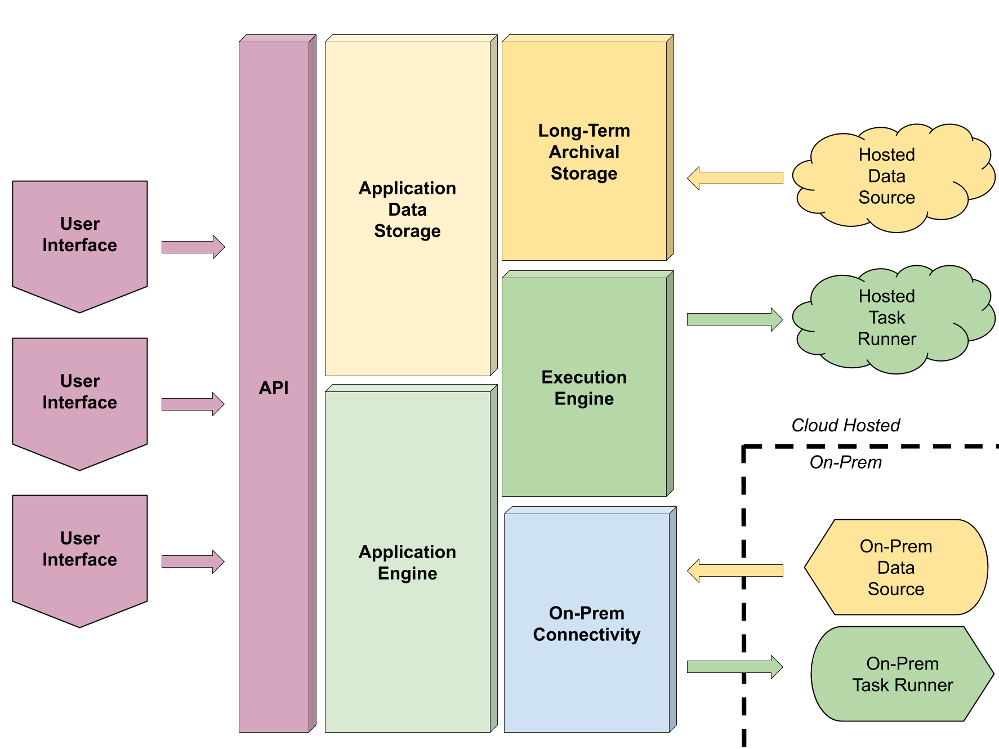
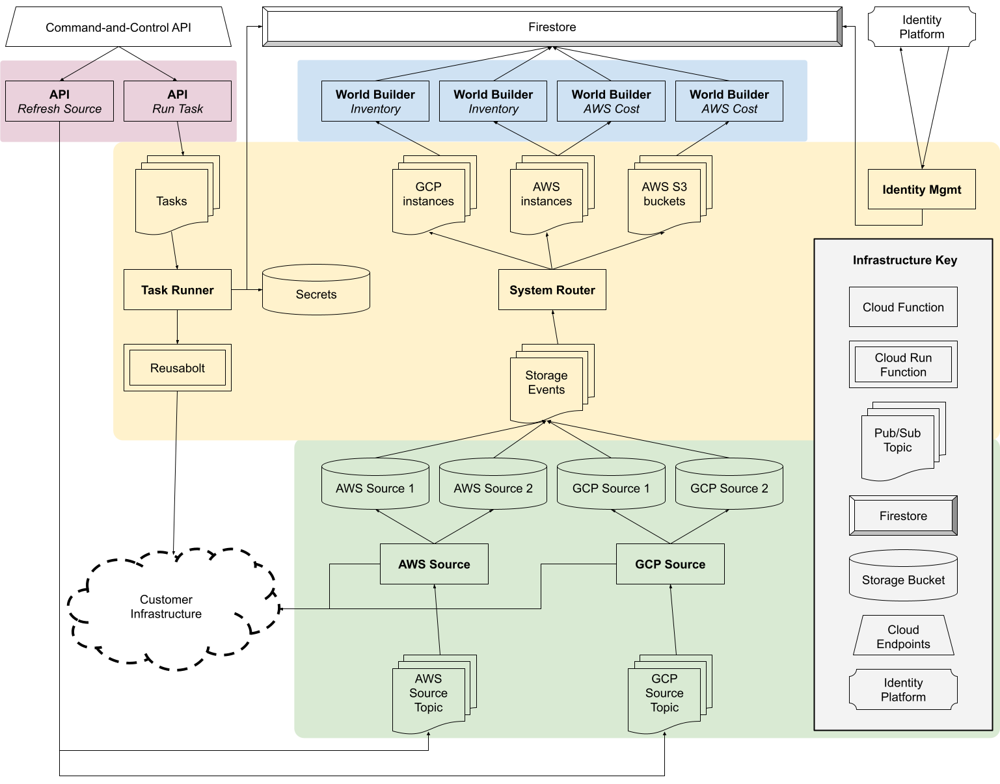

# Mimosa: Reference Architecture for Cloud-Native SaaS Applications

## Introduction

Mimosa was a research activity into cloud-native SaaS architecture using Google Cloud Platform conducted by Puppet in 2019. Mimosa is no longer under active development but offers a collection of cloud-native architectural patterns with corresponding worked examples.

Taking a cloud-native approach to building SaaS products allows developers to buy services directly from cloud vendors instead of building them. That’s advantageous for time to market and scalability. It also allows teams to focus on customer features rather than building their own platforms. That means less time focusing on non-functional considerations like governance, scale, access control, tenancy, authentication, upgrade or data warehousing and more focusing on customer value. It also means less variance between product implementations.

This proof-of-concept supports the following use case: *Discover hosts from multiple cloud-vendor regions or private user infrastructure and take action on those hosts via [Puppet task content](https://puppet.com/docs/bolt/latest/bolt.html)*

## Architectural Overview



The architecture consists of:
* A pipeline for ingesting raw infrastructure data from data sources like cloud APIs or on-prem systems into long-term archival storage
* A placeholder execution engine that can execute Puppet task content on hosted or on-prem hosts
* An application engine that extracts meaning from the raw infrastructure data in order to serve business use-cases as directly as possible
* An API allowing access to and control of all aspects of the system to support both user interfaces and integrations as first class citizens
* A simple UI to illustrate (some) of the underlying capabilities

The architecture is built on a few core principles:
* A serverless approach best supports the inherently event-driven nature of the problem. Events are injected into the system as a consequence of user action, automated scheduling or observation of the real world. Those events trigger an appropriate response like refreshing data, recomputing an aggregate, making a configuration change or others. Each of those responses itself produces events which ripple through the infrastructure. For example, the arrival of fresh data might cause a set of aggregates to be recomputed, the completion of a task might trigger an alert and so on.
* Loose coupling of components and services encourages defense-in-depth and anti-fragility
* Separation of application data from archival data allows us to separate the two concerns of supporting the application at scale and retaining historical data. There’s a tension in serving both those needs from a single data store.

## Running and Deploying Mimosa

Mimosa is primarily a reference artifact but you can build and deploy the proof-of-concept. The [developer guide](DEVELOPERS.md) explains in a lot more detail.

## Detailed Architecture



Shapes in the diagram show deployed infrastructure and the relationship of each piece to the wider system. See the "Deployed Infrastructure" section for more.

Coloured areas in the diagram show broad architectural areas.
* The red area (top left) is the API
* The blue area (top right) covers the “world builders”
* The yellow area (middle) is the core of the system
* The green area (bottom) covers the “sources”

See the "Application Components" section for more.

## Deployed Infrastructure

Mimosa makes use of several different cloud-native services, shown in the “Infrastructure Key” of the diagram.

### Cloud Functions

Serverless functions that respond to HTTP requests or pub/sub messages. These perform the majority of the actual differentiating work in the system. A limited set of programming languages are supported - we are using Go. Cloud Functions scale to demand automatically.

### Cloud Run Functions

Serverless functions running as containers that respond to HTTP requests or pub/sub messages.  Similar to Cloud Functions but with different packaging and deployment semantics. By using a container-based approach we can deploy functions written using any languages and technologies. This allows us to deploy [Puppet Bolt](https://puppet.com/docs/bolt/latest/bolt.html) in a container and, like Cloud Functions, scale to demand automatically.

### Pub/Sub Topics & Subscriptions

Pub/Sub allows us to introduce asynchrony and fan-in/fan-out multiplexing into the system. Events are expressed as messages published to pub/sub topics. That means an API call or other external event results in a Pub/Sub message that is processed asynchronously by one or more serverless functions.

### Cloud IoT Core

IoT Core allows code to run on-prem and handles connectivity and security. Each on-prem entity can be managed and secured independently of the others.

### Firestore

Firestore is a NoSQL database and API. It can store arbitrary application data and allows client apps to access the data directly in a scalable and secure fashion. That means we are not implementing and maintaining our own API code for data access. Firestore offers a security model that allows us to express invariants on our system about data security, like *"no user can access another user’s data"*. Security rules ensure those invariants cannot be broken maliciously or in error.

### Storage Buckets

Storage Buckets are used to store large quantities of data over long periods of time including a historical record of all data and changes ever seen. Where Firestore contains structured application data, Storage Buckets contain natively-formatted raw data obtained from user infrastructure.

### Cloud Endpoints

Firestore provides an API for data access but we wish to provide our own command-and-control HTTP API. Cloud Endpoints acts as an API gateway in front of the Cloud Functions that implement the API based on a formalized OpenAPI specification. It offers separation of concerns by handling authentication and rate limiting independently of API logic.

### Identity Platform

Identity Platform handles user management including authentication and user claims. It offers a large number of authentication providers (email/password, Google, Github etc.) and is well-integrated with Cloud Endpoints and Firestore.

## Application Components

The proof-of-concept application uses the above cloud-native services to implement the following application-level concepts.

### Sources

Sources connect to real-world APIs to discover data like hosts, compliance problems, vulnerabilities, packages and so on. There is a separate source type for each integration we want to support: AWS, Azure, Tenable, VMWare, local scan etc. There may be more than one source of a given type in a user's deployment e.g. one AWS source for the “us-east-1” region and a second for the “eu-west-1” region with different credentials.

For cases where the data comes from a public API (like AWS or Tenable.io) the sources execute on our infrastructure in the cloud. For cases where access to the user's local network is required (like VMWare) the sources are installed and run on the user's own infrastructure and must have internet connectivity back to Mimosa.

Sources store all data in Cloud Storage. This allows us to keep a full historical record of the raw incoming source data at scale with minimal expense. The source has read/write access to its own bucket but to no others. It is free to write any and all relevant data to that bucket, though with some constraints:
* The source should not rewrite data that has not changed. The source might choose to keep a record (again, in the bucket) of timestamps or hashes to prevent unnecessary writes.
* The source should delete data from the bucket when it is no longer active. The bucket itself will store the historical record of previously existent resources.
* The source should write additional summarizing data where useful.
* The source should write JSON but can format the data in the manner of its choosing.
* The source should filter out irrelevant data but minimizing the size of the data is not as important as capturing what we feel is important.
* The source should not transform the received data, and should instead use the native format as far as possible.
* Each object should be tagged with type and semantic version metadata e.g. aws instance v1.2.3

In some cases, sources gather dynamically discovered data that references another statically available data set. For example, vulnerable host assets returned by Qualys refer to vulnerabilities by ID, where the ID is a key into a separate static database of vulnerabilities available from Qualys.

In cases like these, we do not wish to store a complete copy of the vulnerability database in each source. That would lead to duplication of data potentially on a large scale. Instead we store this kind of data in a “static source”. The contents of the static source are updated by us internally as frequently as we deem appropriate. Each static source has a unique name derived from the project name and the kind of data stored. For example, Qualys vulnerabilities are stored in a bucket named something like “static-myproject-qualys”. There may be many Qualys sources deployed by many separate users, but all share this single set of static immutable data. The Qualys source can access the static source using this deterministic name.

Object Versioning will be enabled in each bucket meaning we have a historical record of all data written by each individual source instance over time. We’ll use Object Lifecycle Management to delete data or roll it over to cold storage after a period of time as appropriate.

### System Router

Each bucket has pubsub notifications enabled and all notifications are sent to a system router. The system router is a multiplexer that routes the notification to a per-type pubsub topic. There’s one topic for each supported type, like "aws instance". World Builders (see below) subscribe to these topics, which notify them if objects of interest are created or deleted.

### World Builders

World Builders act directly in service of product use cases. They extract and transform the raw source data into an application-oriented view of the world that is stored in Cloud Firestore. World Builders extract exactly what they need to solve their particular problems from only the sources relevant to them. They normalize data but not against a universally applicable abstract model, rather in service of specific and concrete user interfaces/workflows. They do not anticipate, or attempt to serve, future use cases.

World Builders are not able to write or change any data in the source data buckets but they have read access to all of them. They are triggered in response to bucket writes. Each source stores data in a versioned format and the World Builders are the consumers of that format. As sources evolve and introduce support for new formats, so do the World Builders.

Cloud Firestore is a NoSQL data store and was chosen for the optionality it offers us. As new World Builders are created or as existing ones change in response to new use cases or data formats, the data store can accept and co-mingle whatever application data is necessary.

Firestore also offers two major advantages in terms of scaling and security. In the scaling case, our client web apps talk directly to Firestore. This completely removes the need to support server-side infrastructure underpinning a REST or GraphQL API. We do not need to design or build an API at all - Firestore already offers us what we need. In the security case, because Firestore is designed to be accessed by clients, authentication and access control are deeply integrated.

### Task Runners

Task Runners are analogous to sources in that both perform actions in response to pub-sub events. In principle there is a single task runner, though in practice there will likely be one per region. There are potentially many on-prem task runners, one for each network segment, VPC or similar that we need to reach.

Task Runners wrap [Puppet Bolt](https://puppet.com/docs/bolt/latest/bolt.html), which acts as the mechanism for task execution. Each is deployed in Google Cloud Run as a stateless serverless function. Tasks can be triggered via the Mimosa command-and-control API. The host details are read from Firestore and the task execution payload is built and sent to the Task Runner for processing. Secrets are managed with Berglas. The results of the task run are written back to Firestore in the context of the target host. Currently Mimosa supports only the built-in “facts” task.

## Worked Example

The following steps describe Mimosa's behaviour for a particular user-case to illustrate the architecture described above.

1. The user registers an account.
2. A Cloud Function responds to account creation. It allocates a default workspace and creates a document representing this user in Firestore.
3. The user has no sources and so configures an AWS source with their access/secret keys (note: this step is performed manually in the GCP console in the proof-of-concept).
4. Mimosa allocates a Cloud Storage bucket for that source and configures it to send storage event notifications to the “system router” topic. The bucket is labelled with the ID of this source’s workspace.
5. An update of the AWS source is triggered by publishing the name of the bucket to the AWS source topic (note: again this step is performed manually in the proof-of-concept). Access control will be performed at this point, where we verify that the user attempting to publish the message has access to the chosen source.
6. The AWS source Cloud Function is triggered by the message. It read the AWS config from the bucket, connects to AWS and retrieves a list of AWS instances (and other resources of interest).
7. The AWS source Cloud Function writes an object to the bucket for each AWS instance containing the raw, native representation of that instance. The ID of the object is the source-specific ID of the instance. The source keeps a checksum for every object it writes and if the object has not changed since the last write it is not rewritten. Each object is labelled with a “type” (e.g. “aws-instance”) and a “version” (e.g. 1.0.0).
8. The Cloud Storage writes cause notifications to be published to the “system router” topic.
9. The system router is triggered by each notifications. It reads the workspace label from the bucket and the type from the modified (or deleted) object. The notification is then published onward to a type-specific topic i.e. if an “aws-instance” has been modified, then the Cloud Storage event is passed onto an “aws-instance” topic.
10. Zero or more world builder Cloud Functions might be triggered by the message published to the per-type topic. For example, an inventory world builder might choose to respond to AWS and Azure instances but not AWS VPCs.
11. The inventory Cloud Function extracts only the fields relevant to its use case from the native representation in Cloud Storage and creates documents in Firestore that serve that use case e.g. it might read IP address and hostname but ignore instance type.
12. The piece of the UI responsible for showing inventory accesses the Firestore documents directly.

## Mimosa Data Model

### Tenancy model

The tenancy model is built around two concepts:
* The "account" which represents a human user or an organisation
* The "workspace" which contains user data

Workspaces are the unit of tenancy and are isolated from each other.  Each account has a default workspace and can create additional workspaces to group data in a way that is meaningful to them. A workspace is owned by the account who created it. Accounts can assign permissions to other accounts on a per-workspace basis.

Permissions follow a concentric model:
* A "reader" has read access to the data inside a workspace but cannot run tasks or manage the workspace
* An "executor" can run tasks and has "reader" permissions
* An "admin" can manage sources and permissions associated with a workspace and has "executor" permissions

The workspace "owner" always has "admin" privileges.

#### Permissions example

* Alice, Bob and Cassie create accounts.
* Each has a single default workspace in which they discover inventory data and run tasks.
* Each workspace is completely isolated from the others.
* Alice creates a new workspace called "projectX". She assigns "executor" permissions to Bob and "reader" permissions to Cassie.
* Bob creates a new workspace called "projectY". He assigns "admin" permissions to Cassie.
* Permissions now look as follows (ignoring default workspaces):

    | Workspace |  Alice  |    Bob     |  Cassie  |
    | :-------: | :-----: | :--------: | :------: |
    | projectX  | *owner* | *executor* | *reader* |
    | projectY  |    -    |  *owner*   | *admin*  |

* ABC Company creates an account and workspaces for "team1" and "team2".
  * Alice is given "admin" permission for "team1" and "team2" workspaces
  * Bob is given "executor" permission for the "team1" workspace
* Permissions now look as follows (ignoring default workspaces):

    | Workspace |  Alice  |    Bob     |  Cassie  | ABC Company |
    | :-------: | :-----: | :--------: | :------: | :---------: |
    | projectX  | *owner* | *executor* | *reader* |      -      |
    | projectY  |    -    |  *owner*   | *admin*  |      -      |
    |   team1   | *admin* | *executor* |    -     |   *owner*   |
    |   team2   | *admin* |     -      |    -     |   *owner*   |


#### JWT custom claims

Permissions are captured as custom claims in the JWT allocated at login in the following format:
```
{
    "owner": [ workspace IDs ... ],
    "admin": [ workspace IDs ... ],
    "executor": [ workspace IDs ... ],
    "reader": [ workspace IDs ... ]
}
```
For example:
```json
{
    "owner": [
        "Odud",
        "PCfF",
        "z4Tv"
    ],
    "admin": [
        "2tCw",
        "Lg91"
    ],
    "executor": [
        "t7c0",
        "YM9O",
        "vAgv",
        "odcC",
        "cO5w"
    ],
    "reader": [
        "cxj7"
    ]
}
```

#### Permission limits

1. An unlimited number of accounts can exist.
2. An unlimited number of accounts can be associated with a single workspace.
3. 16 million workspaces are supported system-wide in total.
4. A single account can be associated with up to 100 workspaces.

Limits have been chosen to reduce near-term engineering cost. Supporting unlimited workspaces and unlimited workspaces per account are both possible with additional engineering work and a scaling plan is in place.

### Document structure

Mimosa lays out documents as follows:

* `/users/<userid>`
* `/ws/<workspaceid>`
* `/ws/<workspaceid>/hosts/<hostid>`
* `/ws/<workspaceid>/tasks/<taskid>`
* `/ws/<workspaceid>/vulns/<vulnid>`

Timestamps are RFC 3339 formatted strings.

#### User document

The document ID is obtained from the `uid` field in the JWT as shown [here](https://firebase.google.com/docs/auth/web/manage-users#get_a_users_profile.

The document contains information about the user's workspaces and has the following fields:

```json
{
    "workspaces": {
        "t7c0": "Team A",
        "YM9O": "Team A",
        "vAgv": "Team B",
        "odcC": "Team D",
        "cO5w": "Team E"
    }
}
```

#### Workspace document

The document ID is obtained from the JWT via the custom claim described above as shown [here](https://firebase.google.com/docs/auth/admin/custom-claims#access_custom_claims_on_the_client).

The document contains information about the workspace and has the following fields:

```json
{
    "name": "Team 1",
}
```

#### Host document

The document ID is determined by the source in a deterministic fashion based on the contents. Clients find it by listing the `hosts` subcollection in the chosen workspace.

The document contains information about the host and has the following fields:

```json
{
    "name": "i-064a45abfde8751ca",
    "hostname": "ec2-54-166-212-236.compute-1.amazonaws.com",
    "ip": "54.166.212.236",
    "source": "source-a1529a68-9e5c-4ac6-8fa7-0e43d5089b9d",
    "state": "running",
    "timestamp": " 2019-11-07T14:39:00Z",
    "tasks": {
        "431687819d0085067de627c7d74def727cc9dee8": {
            "status": "success",
            "timestamp": " 2019-11-07T14:39:00Z",
        },
        "c43c3e2501ac98bf2546fe250d9def8bca087006": {
            "status": "failure",
            "timestamp": " 2019-11-07T14:39:00Z",
        }
    }
}
```

#### Task document

The document ID is allocated by Firestore. Clients find it by listing the `tasks` subcollection in the chosen workspace.

The document contains the raw output from Bolt for a single task on a single host. The format is determined by Bolt.

#### Vulnerability document

The document ID is chosen by Firestore.

The document contains information about vulnerable hosts and has the following fields:

```json
{
    "id": "12345",
    "name": "heartbleed",
    "score": "9.9",
    "count": 55,
    "hosts": {
        "0c03de6ed173e4b4fe1a8f5307996fd429da6260": {
            "id": "556677",
            "name": "ec2-23-777-765-189.compute-2.amazonaws.com",
            "hostname": "10.10.10.10"
        },
        "e1a8f5307996fd429da62609d0085067de627c7d": {
            "id": "558899",
            "name": "ec2-63-479-735-209.compute-1.amazonaws.com",
            "hostname": "10.11.11.11"
        }
    }
}
```

#### Security rules

```
rules_version = '2';
service cloud.firestore {
  match /databases/{database}/documents {
  	function isOwner(ws) {
      return ws in request.auth.token.owner;
   	}

   	function isAdmin(ws) {
      return ws in request.auth.token.admin;
   	}

   	function isExecutor(ws) {
      return ws in request.auth.token.executor;
   	}

    function isReader(ws) {
      return ws in request.auth.token.reader;
   	}

    function userHasWorkspace(ws) {
        return get(/databases/$(database)/documents/users/$(request.auth.uid)).data.workspaces[ws] != null;
    }

    match /ws/{ws}/{documents=**} {
      allow read, write: if isAdmin(ws) || isOwner(ws)
      allow read: if isExecutor(ws) || isReader(ws) || userHasWorkspace(ws)
  	}

    match /users/{user} {
        allow read: if request.auth != null && request.auth.uid == resource.id;
    }
  }
}
```

## Service Availability

|        Service         | Availability |
| :--------------------: | :----------: |
|     Cloud Storage      | Multi-region |
|       Firestore        | Multi-region |
|    Cloud Functions     |   Regional   |
|  Cloud Run Functions   |   Regional   |
| Key Management Service | Multi-region |
|        Pub/Sub         |    Global    |

Regional services are resilient to failures within a single GCP zone. Multi-region services are available in both the US and Europe, and are resilient to a total failure of a single region. Global services are resilient to multiple region failures.

## Contributions

The Mimosa project is now complete and will no longer be maintained.

We're not accepting major contributions but if you find any mistakes we'd love it if you raised an issue or pull request. Thanks!
